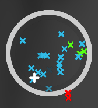

# pp_calc_server overlay

实时 pp 曲线显示 overlay，基于 [gosumemory](https://github.com/l3lackShark/gosumemory)。

演示视频：[BV1bF411w7GM](https://www.bilibili.com/video/BV1bF411w7GM)


<table>


</table>

## 特性
* 基于 gosumemory，可以用于直播端和 gameoverlay。
* 实时更新的 PP 曲线图。
* 计算后端的 CPU 和内存开销极小。
* 自带分数指示器。
* 分数指示器拥有打图反馈。

## 详细细节
### pp_calc_server
由 Rust 语言实现的 PP 曲线计算器，基于 [rosu-pp](https://github.com/MaxOhn/rosu-pp)。

该程序用于计算当前打图状态（300/100/50/miss/combo）下不同 accuracy 的 PP。计算 tick 为 gosumemory 设置的 update 时间。

### pp_graph_game_info
overlay 主体，他会和 pp_calc_server 进行 WebSocket 通信（就像和 gosumemory 通信一样），传输指令和计算结果。

#### 分数指示器

显示当前 score，accuracy，combo 和 pp，在直播端使用时需要按 CTRL + TAB 把游戏中的分数指示器关掉（可选）。

> 如果仅使用分数指示器，则不需要 pp_calc_server 程序。

对于 combo 指示器，如果没有 miss 或 miss 之后连了比之前更多的 combo 数，combo 指示器会变成绿色，其代表了当前打图的最大 combo 数。

对于 accuracy 指示器和 PP 指示器，如果数值比之前高，它会变成绿色，代表 accuracy 或 PP 提高了，否则它会变成红色。

#### PP 曲线图 (需要 pp_calc_server)

在 PP 曲线图中，黄色曲线代表如果全连（Full Combo）的 PP 曲线，白色代表当前状态如果在结束时全连的 PP 曲线，绿色的点表示此时此刻的 PP 值，同 PP 指示器。

曲线是动态更新的，并且有动画。

#### Heatmap 打击图 (需要 pp_calc_server)

圆形的打击图，用来显示每个打击的 note 的鼠标相对位置，同时用不同颜色区分打击状态。

## 使用
首先要安装 Rust 的工具链 [cargo](https://doc.rust-lang.org/cargo/getting-started/installation.html)。

运行 `cargo build --release` 构建 pp_calc_server，构建好的程序在 `target/release/pp_calc_server.exe` (Windows)。

不想自己构建可以前往 [releases](https://github.com/StageGuard/pp_calc_server/releases) 下载预构建程序。

把 [gosumemory_static/pp_graph_game_info](gosumemory_static/pp_graph_game_info) 文件夹 放到 `你的gosumemory目录/static/` 下。

打开 `pp_graph_game_info/config.js` 按照说明修改配置选项。

打开 `pp_calc_server.exe` 会看到程序有如下输出：
```
listening at "127.0.0.1:24051"
```

打开 gosumemory 程序，在 OBS 中添加浏览器源。
* 分数指示器：`http://127.0.0.1:24050/pp_graph_game_info/` ，大小 `1920x1080`。
* PP 曲线图：`http://127.0.0.1:24050/pp_graph_game_info/ppCurveChart.html` ，大小 `450x270`。
* Heatmap 打击图：`http://127.0.0.1:24050/pp_graph_game_info/heatmap.html` ，大小 `600x600`。

> 如果要使用 Heatmap 打击图，在[此 Pull Request](https://github.com/l3lackShark/gosumemory/pull/145) 合并之前，请使用[此版本](https://github.com/StageGuard/gosumemory)的 gosumemory。
你可以在 release 中下载 gosumemory 的预构建程序。
